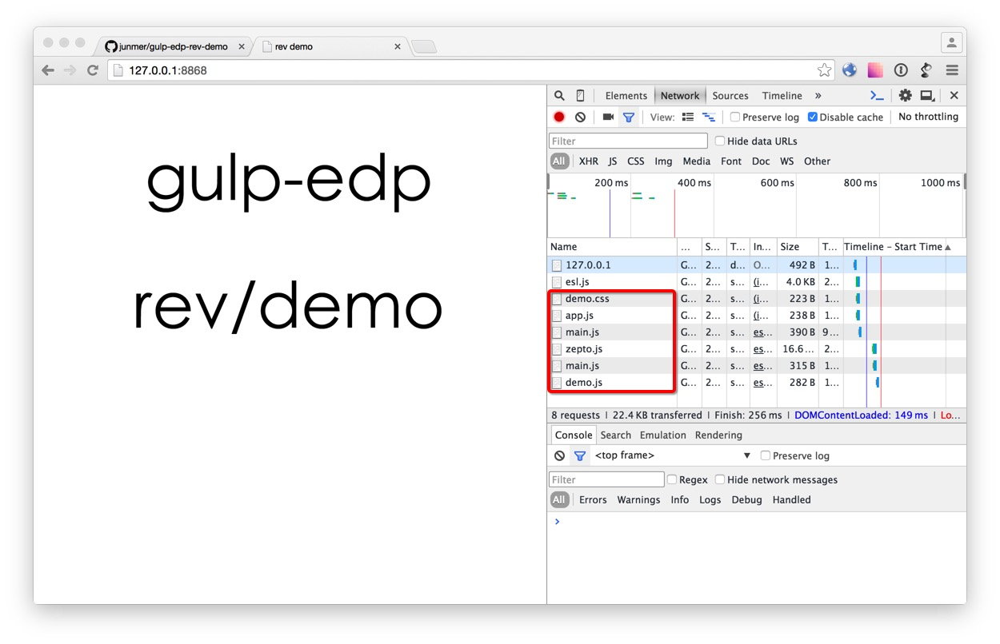
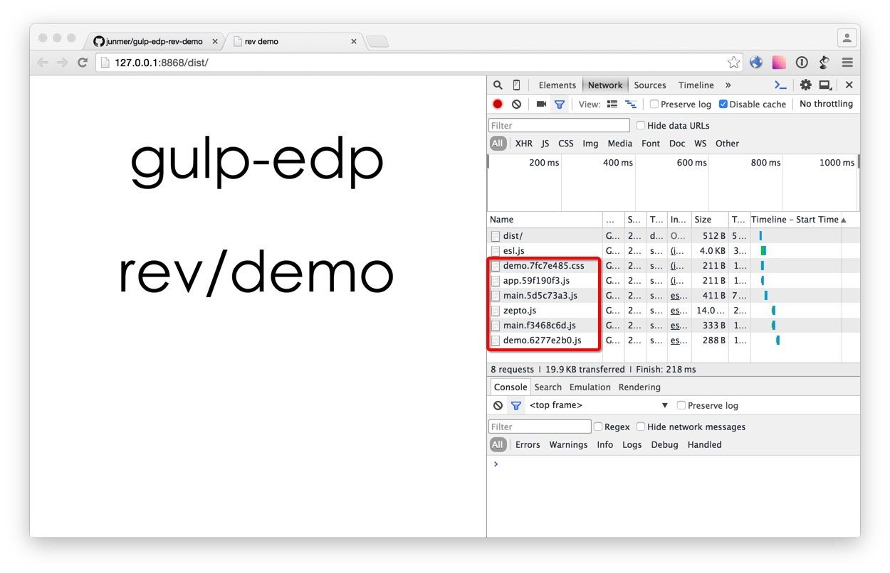

# rev demo

> gulp-edp rev demo

## Usage

```sh
git clone https://github.com/junmer/gulp-edp-rev-demo.git
cd gulp-edp-rev-demo
npm install
edp update
gulp
edp webserver start
```

## Demo

- open <http://127.0.0.1:8868> show source demo



- open <http://127.0.0.1:8868/dist> show dist demo


